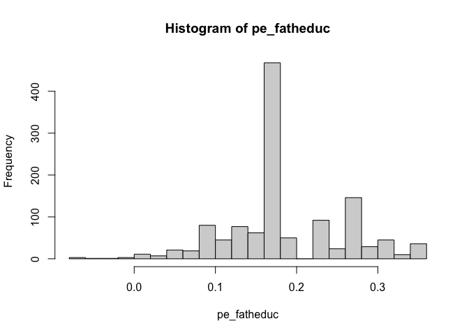

<!-- README.md is generated from README.Rmd. Please edit that file -->

# An R Package for Stubborn Longhorn Economists

<!-- badges: start -->

<!-- badges: end -->

This is a package that attempts to mimic the full suite of Stata used in
the ECO394M Econometrics class. The goal is to make the usage of this R
package as close to Stata as possible, and to provide the tools so that
the naive user can replicate Stata in a non-proprietary language. It is
not necessarily the quickest way to do something in R. For that, dig
into the code here on GitHub.

## Installation

This code is hosted on [GitHub](https://github.com/). Use the devtools
package to download the package:

``` r
# install.packages("devtools")
devtools::install_github("nateybear/longhorn-rstata")
```

## Example

Let’s walk through an example using the HTV.DTA dataset from class. I
will briefly run through all of the functions that are in the package.
If you need more documentation on, for example, the `gen` function, then
type `?gen` in your R console.

### use

The `use` command will load a dataset. Like Stata, rstata is meant to
work with one dataset at a time. Let’s browse our computer for the
HTV.DTA file and load it:

``` r
use()
```

Now we can use the rest of the rstata functions.Note that the dataset is
attached to your R environment, so you can use the columns of HTV.DTA
directly.

``` r
summary(abil)
#>    Min. 1st Qu.  Median    Mean 3rd Qu.    Max. 
#> -5.6315  0.5662  2.1498  1.7966  3.4615  6.2637
```

Note you can also browse through your Environment tab in RStudio and
view the values in the dataset:


### regr

The `regr` command fits a model just like Stata. Note the tilde instead
of the equal sign from Stata. Separate options with multiple commas.

This will get filled out with more options as we go along. Have patience
:)

``` r
regr(educ ~ motheduc + fatheduc + abil)
#> 
#> Call:
#> stats::lm(formula = formula, data = .data())
#> 
#> Residuals:
#>    Min     1Q Median     3Q    Max 
#> -5.407 -1.195 -0.199  1.076  7.012 
#> 
#> Coefficients:
#>             Estimate Std. Error t value Pr(>|t|)    
#> (Intercept)  8.44869    0.28954  29.180  < 2e-16 ***
#> motheduc     0.18913    0.02851   6.635 4.87e-11 ***
#> fatheduc     0.11109    0.01988   5.586 2.85e-08 ***
#> abil         0.50248    0.02572  19.538  < 2e-16 ***
#> ---
#> Signif. codes:  0 '***' 0.001 '**' 0.01 '*' 0.05 '.' 0.1 ' ' 1
#> 
#> Residual standard error: 1.784 on 1226 degrees of freedom
#> Multiple R-squared:  0.4275, Adjusted R-squared:  0.4261 
#> F-statistic: 305.2 on 3 and 1226 DF,  p-value: < 2.2e-16
```

### b\_

After the regression is run, you can access the fitted coefficients with
`b_`, just like Stata’s \_b. Note that this is a function in R, so use
parentheses:

``` r
b_(motheduc)
#>  motheduc 
#> 0.1891314
```

### gen

Use the `gen` function to create new variables and attach to your
dataset. As an example, let’s create a more complex model that has an
interaction effect. Then we’re going to compute the partial effect of
mother’s education on the dataset and plot a histogram.

``` r
regr(educ ~ motheduc*fatheduc + abil)
#> 
#> Call:
#> stats::lm(formula = formula, data = .data())
#> 
#> Residuals:
#>    Min     1Q Median     3Q    Max 
#> -5.319 -1.184 -0.163  1.041  6.971 
#> 
#> Coefficients:
#>                    Estimate Std. Error t value Pr(>|t|)    
#> (Intercept)       11.477880   0.748689  15.331  < 2e-16 ***
#> motheduc          -0.065373   0.064609  -1.012   0.3118    
#> fatheduc          -0.140388   0.060691  -2.313   0.0209 *  
#> abil               0.511182   0.025606  19.963  < 2e-16 ***
#> motheduc:fatheduc  0.020410   0.004658   4.382 1.28e-05 ***
#> ---
#> Signif. codes:  0 '***' 0.001 '**' 0.01 '*' 0.05 '.' 0.1 ' ' 1
#> 
#> Residual standard error: 1.77 on 1225 degrees of freedom
#> Multiple R-squared:  0.4363, Adjusted R-squared:  0.4345 
#> F-statistic: 237.1 on 4 and 1225 DF,  p-value: < 2.2e-16
```

This includes our first “weird” variable name. Make sure to surround the
variable for the interaction term with a backtick (\`). Let’s compute
the partial effect now and plot a histogram:

``` r
gen(pe_fatheduc = b_(motheduc) + fatheduc * b_(`motheduc:fatheduc`))
hist(pe_fatheduc)
```



### testnl

Test multiple (possibly non-linear) restrictions jointly. This uses the
delta method to get the variance of non-linear functions of the beta
parameters, and then computes a Wald chi-square test statistic.

Note that this gives an exact answer for linear restrictions thanks to
symbolic differentiation. Hence there is no loss of precision if you are
testing something like a single linear restriction:

``` r
# test that b_(motheduc) = 0. Compare the pval to the output of regr.
# TODO this uses robust standard error, need to integrate with regr!!!
testnl(motheduc)
#> (1) motheduc = 0
#>  estimate: -0.07
#> 
#> 
#>      chi2(1) = 0.68
#>      Prob > chi2 = 0.4083
```

You can do a partial F-test:

``` r
testnl(`motheduc:fatheduc`, abil)
#> (1) motheduc:fatheduc = 0
#>  estimate: 0.02
#> 
#> (2) abil = 0
#>  estimate: 0.51
#> 
#> 
#>      chi2(2) = 359.21
#>      Prob > chi2 = 0.0000
```

Or you can test a non-linear restriction:

``` r
testnl(sqrt(motheduc^2 + fatheduc^2) - 1)
#> (1) sqrt(motheduc^2 + fatheduc^2) - 1 = 0
#>  estimate: -0.85
#> 
#> 
#>      chi2(1) = 96.23
#>      Prob > chi2 = 0.0000
```
